# Roboprime 🤖
> Full featured 21 DOF 3D Printed Humanoid Robot based on ATmega328P chip

  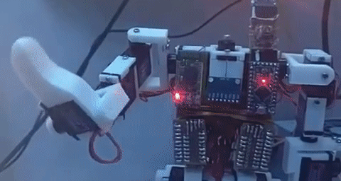

Description coming soon.

### Press
The project has been featured here:

  
  

### Gallery
Some images done during the development process:

  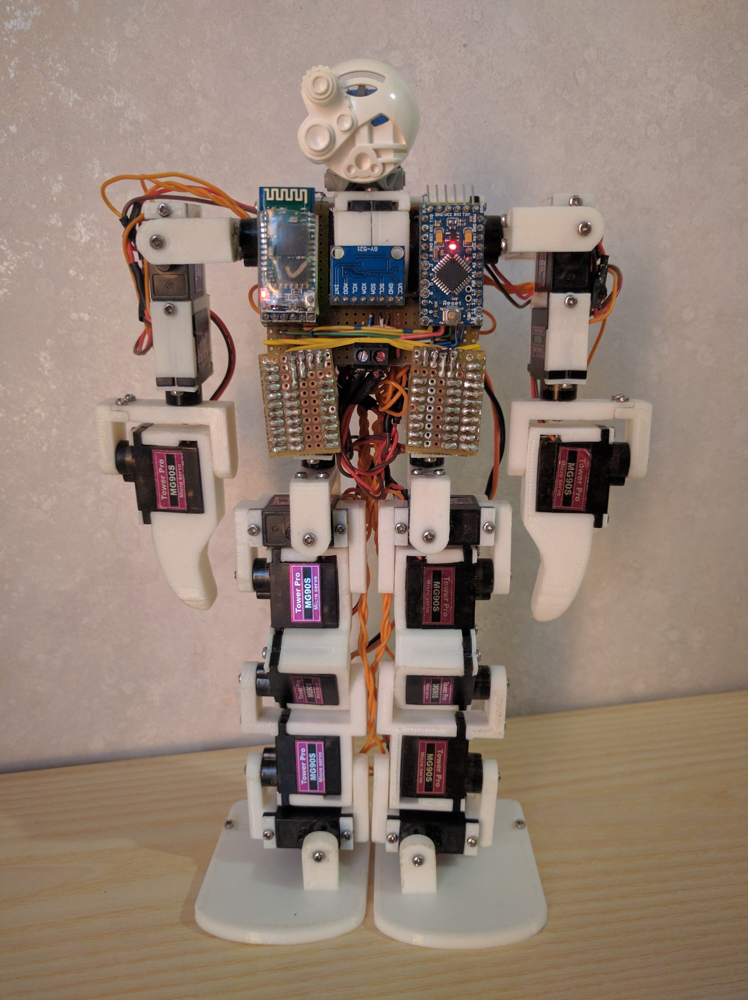
  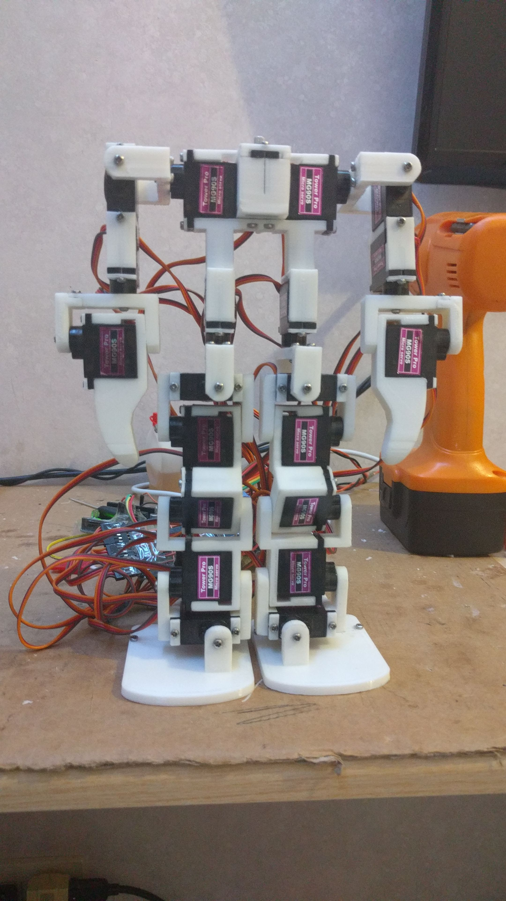
  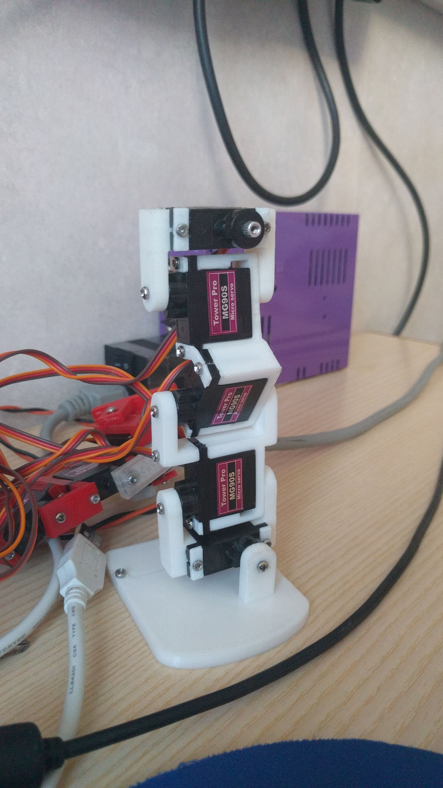
  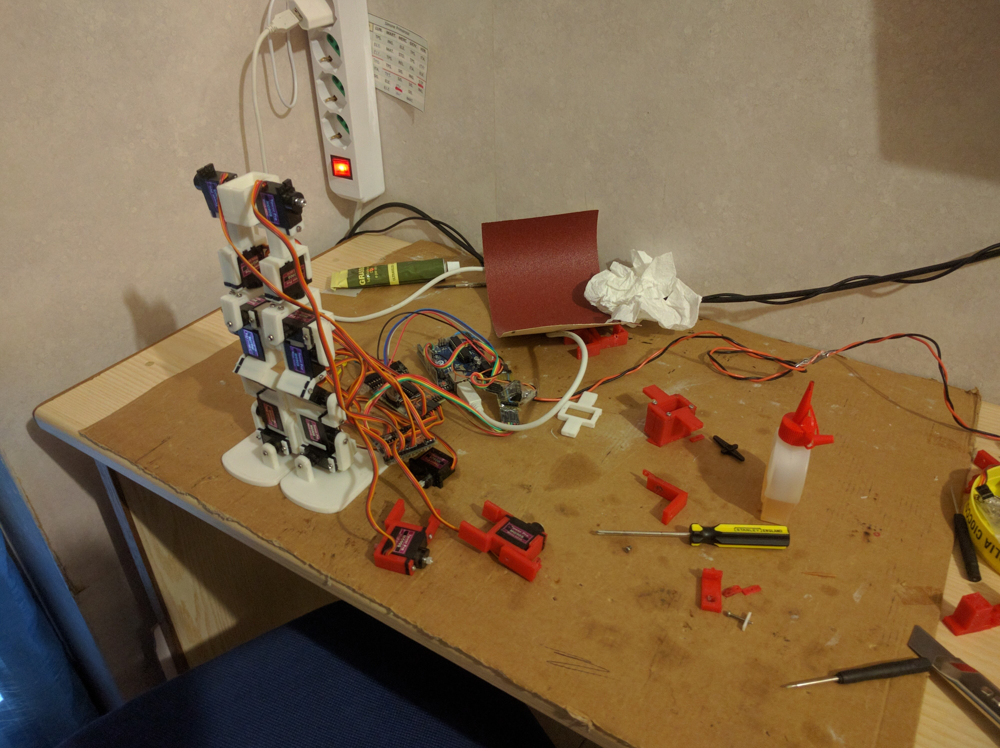
  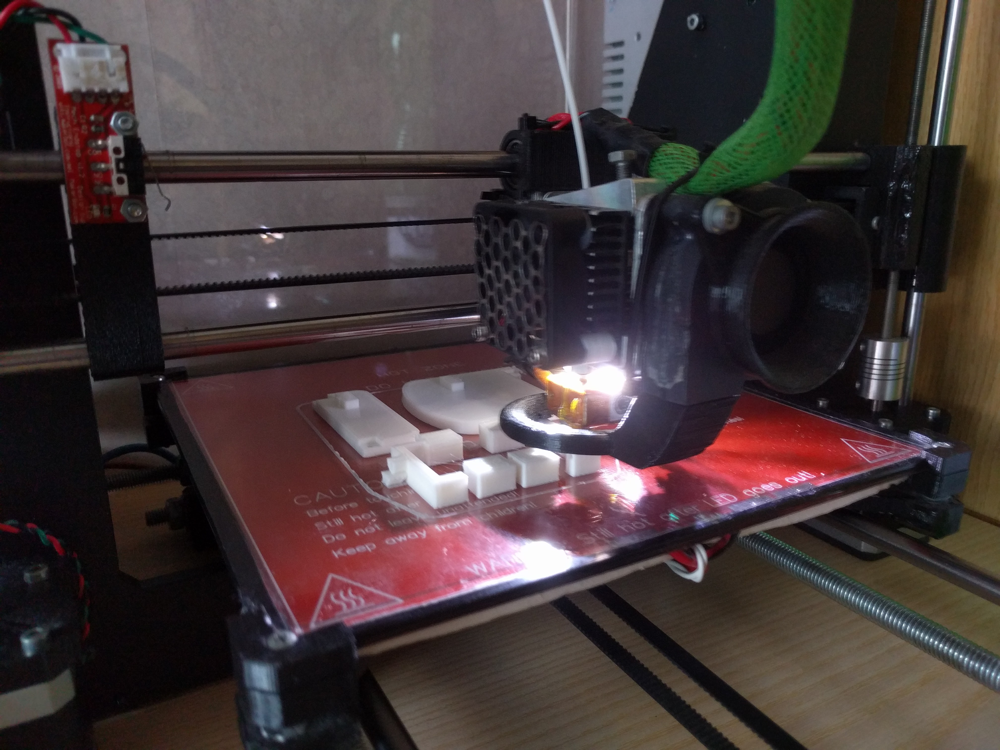
  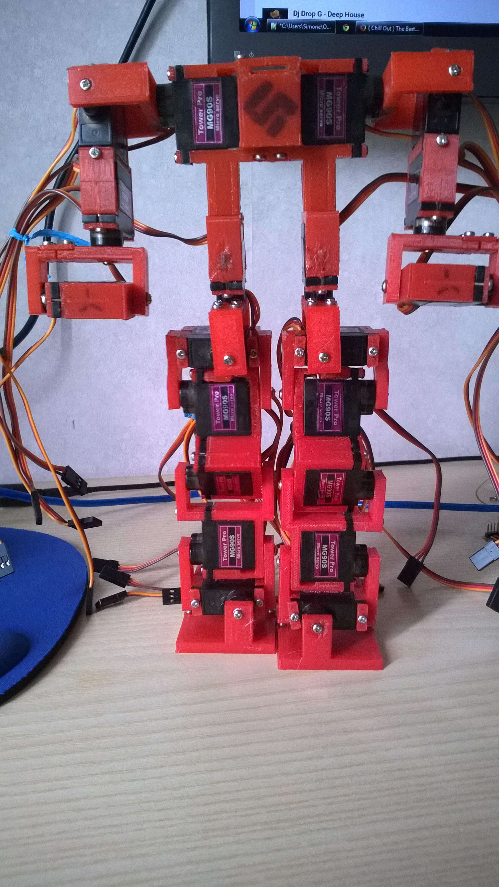
  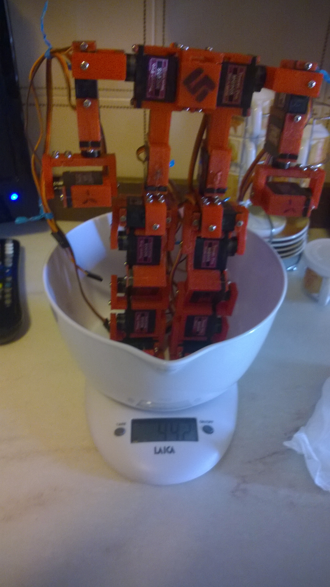
  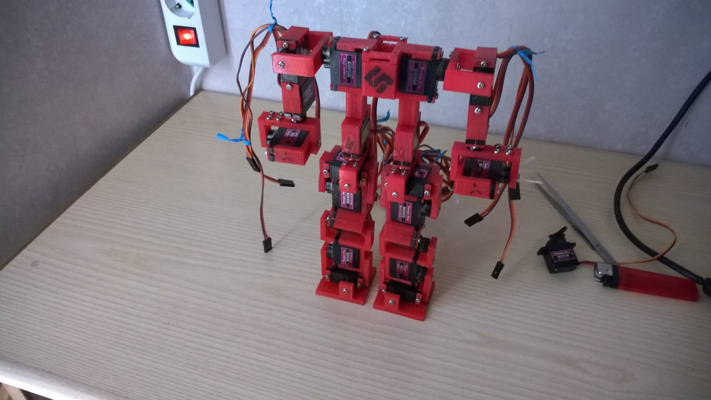
  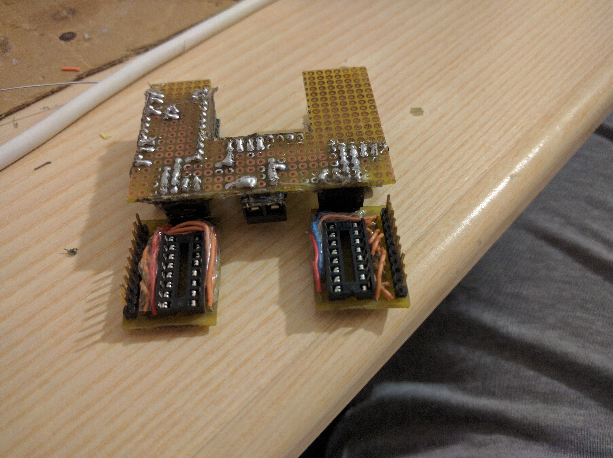
  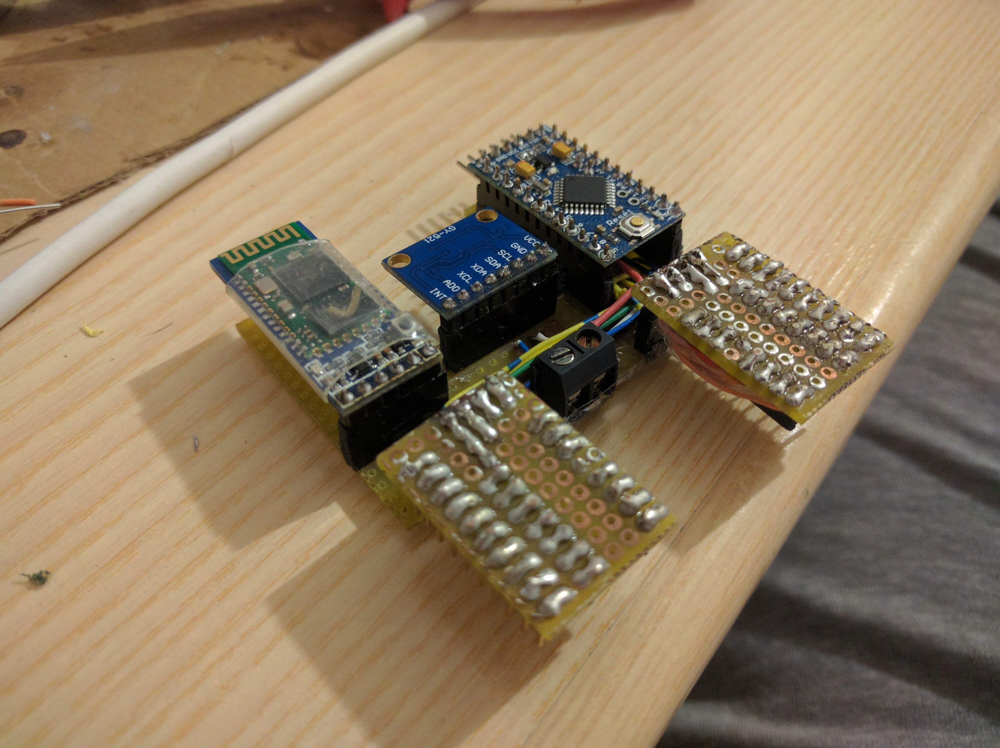
  
  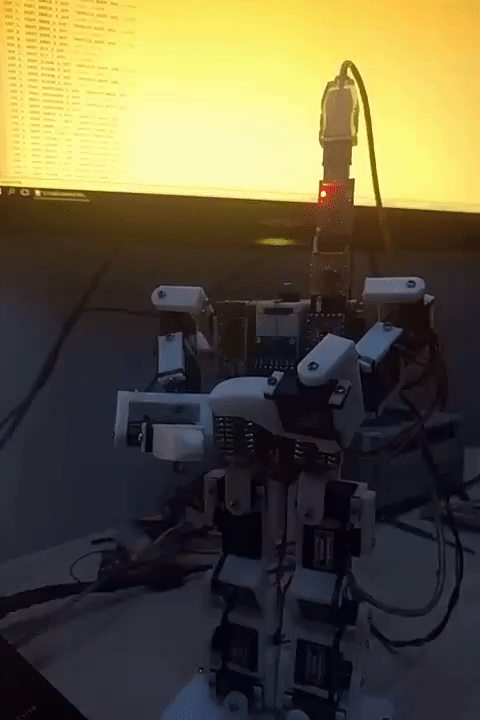
  
  

> Click on the image to enlarge.

## Getting Started

### Bill of Materials
Amount | Hardware
---|---
1 | Arduino Pro Micro (Atmega328p)
1 | HC-05 (Bluetooth)
2 | 74HC4017 (5-stage Johnson decade counter)
1 | MPU-6050 (Gyroscope + Accellerometer UNUSED)
21 | MG90S 9G (Servo motors)
1 | Ad-hoc board (See wiring section)

Amount | Screw
---|---
37 | M2 x 4mm
32 | M2 x 14mm
19 | M2 x 20mm

Amount | 3D Model | Amount | 3D Model
---|---|---|---
38 | [SP_Cover_1_foro](3D/stl/1xSP_Cover_1_foro.stl) |  | 
1 | [MID_Scapole](3D/stl/1xMID_Scapole.stl) |  | 
2 | [MID_Torace](3D/stl/1xMID_Torace.stl) |  | 
1 | [MID_Anca_TOP](3D/stl/1xMID_Anca_TOP.stl) |  | 
2 | [MID_Anca_BTM](3D/stl/1xMID_Anca_BTM.stl) |  | 
1 | [DX_Spalla_A](3D/stl/1xDX_Spalla_A.stl) | 1 | [SX_Spalla_A](3D/stl/1xDX_Spalla_A.stl)
1 | [DX_Spalla_B](3D/stl/1xDX_Spalla_B.stl) | 1 | [SX_Spalla_B](3D/stl/1xDX_Spalla_B.stl)
1 | [DX_Avambraccio_A](3D/stl/1xDX_Avambraccio_A.stl) | 1 | [SX_Avambraccio_A](3D/stl/1xDX_Avambraccio_A.stl)
1 | [DX_Avambraccio_B](3D/stl/1xDX_Avambraccio_B.stl) | 1 | [SX_Avambraccio_B](3D/stl/1xDX_Avambraccio_B.stl)
1 | [DX_Gomito_A](3D/stl/1xDX_Gomito_A.stl) | 1 | [SX_Gomito_A](3D/stl/1xDX_Gomito_A.stl)
1 | [DX_Gomito_B](3D/stl/1xDX_Gomito_B.stl) | 1 | [SX_Gomito_B](3D/stl/1xDX_Gomito_B.stl)
1 | [DX_Braccio](3D/stl/1xDX_Braccio.stl) | 1 | [SX_Braccio](3D/stl/1xDX_Braccio.stl)
1 | [DX_Anca_A](3D/stl/1xDX_Anca_A.stl) | 1 | [SX_Anca_A](3D/stl/1xDX_Anca_A.stl)
1 | [DX_Anca_B](3D/stl/1xDX_Anca_B.stl) | 1 | [SX_Anca_B](3D/stl/1xDX_Anca_B.stl)
1 | [DX_Inguine_A](3D/stl/1xDX_Inguine_A.stl) | 1 | [SX_Inguine_A](3D/stl/1xDX_Inguine_A.stl)
1 | [DX_Inguine_B](3D/stl/1xDX_Inguine_B.stl) | 1 | [SX_Inguine_B](3D/stl/1xDX_Inguine_B.stl)
1 | [DX_Ginocchio_A](3D/stl/1xDX_Ginocchio_A.stl) | 1 | [SX_Ginocchio_A](3D/stl/1xDX_Ginocchio_A.stl)
1 | [DX_Ginocchio_B](3D/stl/1xDX_Ginocchio_B.stl) | 1 | [SX_Ginocchio_B](3D/stl/1xDX_Ginocchio_B.stl)
1 | [DX_Gamba_A](3D/stl/1xDX_Gamba_A.stl) | 1 | [SX_Gamba_A](3D/stl/1xDX_Gamba_A.stl)
1 | [DX_Gamba_B](3D/stl/1xDX_Gamba_B.stl) | 1 | [SX_Gamba_B](3D/stl/1xDX_Gamba_B.stl)
1 | [DX_Caviglia_A](3D/stl/1xDX_Caviglia_A.stl) | 1 | [SX_Caviglia_A](3D/stl/1xDX_Caviglia_A.stl)
1 | [DX_Caviglia_B](3D/stl/1xDX_Caviglia_B.stl) | 1 | [SX_Caviglia_B](3D/stl/1xDX_Caviglia_B.stl)
1 | [DX_Piede_A](3D/stl/1xDX_Piede_A.stl) | 1 | [SX_Piede_A](3D/stl/1xDX_Piede_A.stl)
1 | [DX_Piede_B](3D/stl/1xDX_Piede_B.stl) | 1 | [SX_Piede_B](3D/stl/1xDX_Piede_B.stl)

> SX_* models needs to be mirrored on the correct axis before the printing process.

### Wiring

### Firmware size

## Commands
The firmware allows you to fully control the robot through bluetooth in order to make complex things.
Those are the commands implemented that can be sended through the serial protocol.

Name | Syntax | Parameters
---|---|---
S0 | `S0 Ri` or `S0 Li` | **i** = index[0-9] (optional)
S1 | `S1 Ri Ad` or `S1 Li Ad` | **i** = index[0-9], **d** = angle[0-1800]
S2 | `S1 Ri Ad Tm` or `S1 Li Ad Tm` | **i** = index[0-9], **d** = angle[0-1800], **m** = duration[ms]
S3 | `S3 An Ds Tm` | **n** = anim idx[0-10], **s** = space[cm], **m** = duration[ms]
Q0 | `Q0 Ri Ad` or `S1 Li Ad` | **i** = index[0-9], **d** = angle[0-1800]
C0 | `Ri Wp` or `Li Wp` | **i** = index[0-9], **p** = pulse witdh[us]

Name | Description
---|---
S0 | Move a servo to its default position. If no index is passed all servos will be resetted.
S1 | Move a servo to a specific angle. The value 0 corresponds to 0° and the value 1800 corresponds to 180°.
S2 | Move a servo to a specific angle gradually by sweeping it for a specific amount of time.
S3 | Apply a specific animation. Space and Duration are not used at the moment but are supposed to be used as parameters for certains animations.
Q0 | Same as `S1` but the movement is added to the movements queue. If the angle value is 0 a pause will be planned instead. (A pause will make the next planned movement, on the same motor index, hang until the pause is not ended) This is used in order to plan complex syncronized movements. (E.g. Animations)
C0 | Sets a specific pulse width to a specific motor for calibration purposes.

## Animations
The firmware contains some basic animations hardcoded inside it:

 
  
<b>Forward walk</b> - <i>work-in-progress</i>

   
  

 
  
<b>Backward walk</b> - <i>unavailable</i>

   
  

 
  
<b>Side walk to right</b> - <i>unavailable</i>

   
  

 
  
<b>Side walk to left</b> - <i>unavailable</i>

   
  

 
  
<b>Clockwise standstill rotation</b> - <i>unavailable</i>

   
  

 
  
<b>Counterclockwise standstill rotation</b> - <i>unavailable</i>

   
  

 
  
<b>Clockwise curved walk</b> - <i>unavailable</i>

   
  

 
  
<b>Counterclockwise curved walk</b> - <i>unavailable</i>

   
  

 
  
<b>Upward lift</b> - <i>unavailable</i>

   
  

 
  
<b>Downward lift</b> - <i>unavailable</i>

   
  

 
  
<b>Sit down</b> - <i>done</i>

   
  

 
  
<b>Hello</b> - <i>done</i>

   
  

 
  
<b>F*ck off</b> - <i>done</i>

   
  

 

> Click on the arrow to see an example of the animation!

## Project Analysis
This document was written for my high-school exam in order to give to the professors some basic knowledge to make them understand how the project works.

Unfortunately it's written in Italian 🇮🇹

[The document is available here](https://goo.gl/fZM7Dc)

## Authors
* **Simone Primarosa** - [simonepri](https://github.com/simonepri)

See also the list of [contributors](https://github.com/simonepri/roboprime/contributors) who participated in this project.

## License
This project is licensed under the GPL-3.0 License - see the [LICENSE.md](LICENSE.md) file for details.
